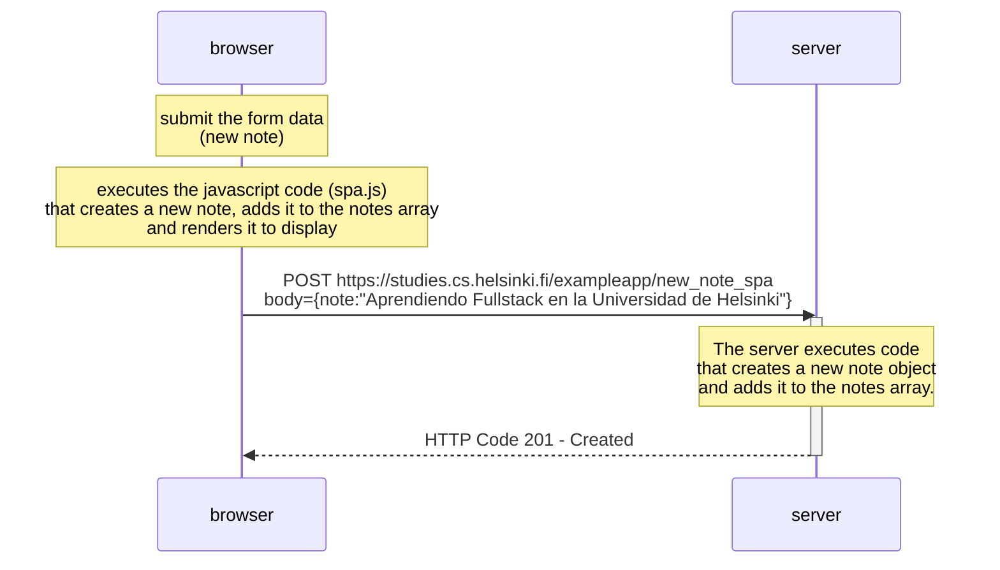

```mermaid
sequenceDiagram
    participant browser
    participant server

    Note over browser: submit the form data <br> (new note)
    Note over browser: executes the javascript code (spa.js) <br> that creates a new note, adds it to the notes array <br> and renders it to display
    browser->>server: POST https://studies.cs.helsinki.fi/exampleapp/new_note_spa <br> body={note:"Aprendiendo Fullstack en la Universidad de Helsinki"}
    activate server
    Note over server: The server executes code <br> that creates a new note object <br> and adds it to the notes array.
    server-->>browser: HTTP Code 201 - Created
    deactivate server
```
